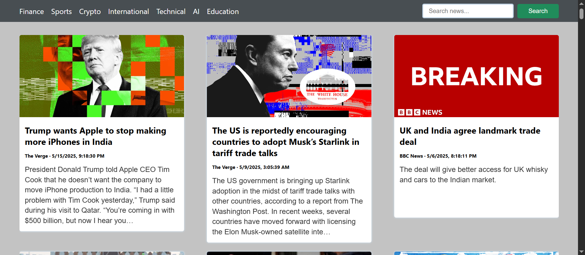

# Aplicación de Noticias

Una aplicación web simple que muestra artículos de noticias por categoría y búsqueda, con un diseño moderno y responsivo.

## Características
- Navegar por categorías: Finanzas, Deportes, Criptomonedas, Internacional, Técnico, IA, Educación
- Buscar artículos de noticias por palabra clave
- Diseño de tarjetas responsivo
- Tarjetas de noticias clickeables que abren el artículo completo en una nueva pestaña

## Estructura del Proyecto

- `index.html`: Archivo HTML principal que contiene la barra de navegación, la barra de búsqueda y la plantilla para las tarjetas de noticias.
- `style.css`: Hoja de estilos para el diseño, colores, fuentes y diseño responsivo.
- `script.js`: Lógica de JavaScript para obtener noticias, manejar la navegación, la búsqueda y actualizaciones dinámicas del DOM.

## Cómo Funciona

1. **Navegación**: Haz clic en una categoría en la barra de navegación para cargar artículos de noticias relacionados.
2. **Búsqueda**: Ingresa una palabra clave y haz clic en 'Buscar' para encontrar artículos de noticias que coincidan con tu consulta.
3. **Tarjetas de Noticias**: Los artículos se muestran como tarjetas con imagen, título, fuente, fecha y descripción. Al hacer clic en una tarjeta, se abre el artículo.

## Configuración y Uso

1. Clona o descarga este repositorio.
2. Asegúrate de tener un backend o un endpoint de API que sirva datos de noticias en `http://localhost:3000/` (ver `script.js`).
   - Por defecto, el código espera un servidor local que devuelva artículos de noticias en el formato de [NewsAPI](https://newsapi.org/).
3. Abre `index.html` en tu navegador.

## Conexión a la API

La aplicación utiliza la API de NewsAPI para obtener datos de noticias. Para configurar la conexión:

- En `script.js`, se define una constante `API_KEY` que debe ser reemplazada con tu clave de API de NewsAPI.
- La URL base para las solicitudes de noticias se configura en la constante `url`. Por defecto, se apunta a la API de NewsAPI, que es `https://newsapi.org/v2/everything?q=`.
- Para usar la API de NewsAPI, asegúrate de que la URL y la clave de API sean correctas. La solicitud se realiza a la URL de la API de NewsAPI, y se espera que devuelva artículos de noticias en el formato adecuado.

## Personalización
- Para usar una API de noticias diferente, actualiza la `url` y `API_KEY` en `script.js`.
- Ajusta las categorías en la barra de navegación editando el `<ul>` en `index.html`.
- Modifica los estilos en `style.css` según lo desees.

## Captura de Pantalla de Ejemplo

---

**Nota:** Este proyecto es para fines educativos/demostrativos y requiere una API de noticias o un servidor simulado para su funcionamiento completo. 